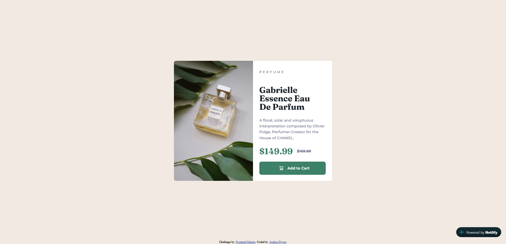
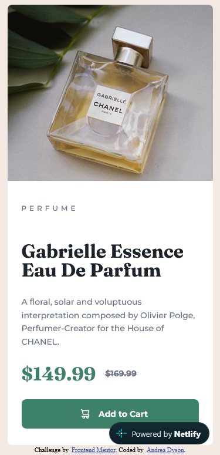
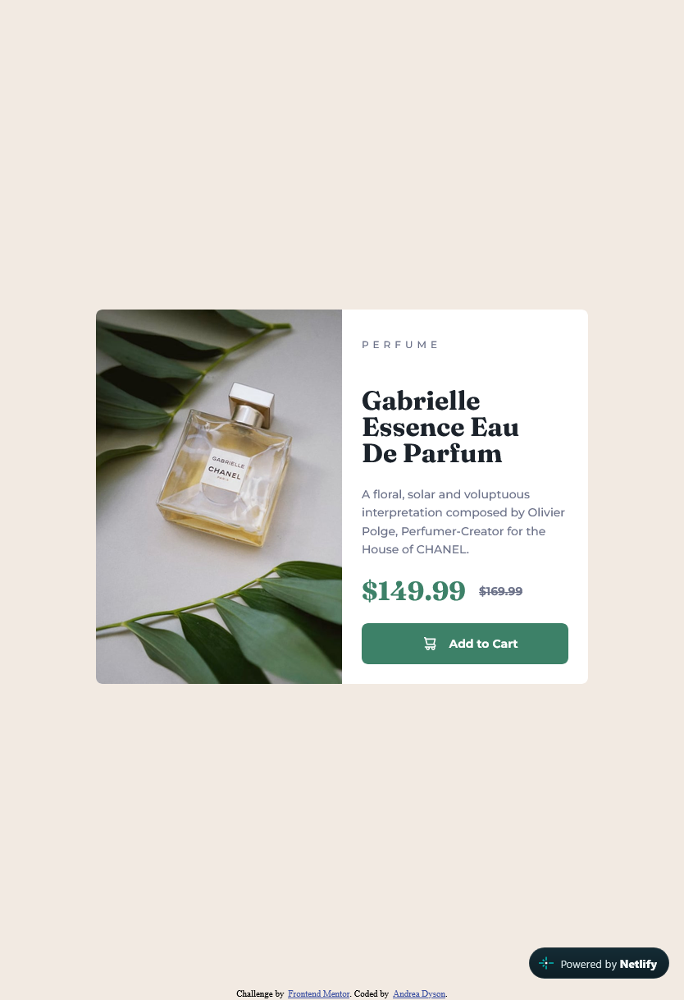

# Frontend Mentor - Product preview card component solution

This is a solution to the [Product preview card component challenge on Frontend Mentor](https://www.frontendmentor.io/challenges/product-preview-card-component-GO7UmttRfa). Frontend Mentor challenges help you improve your coding skills by building realistic projects. 

## Table of contents

- [Overview](#overview)
  - [The challenge](#the-challenge)
  - [Screenshot](#screenshot)
  - [Links](#links)
- [My process](#my-process)
  - [Built with](#built-with)
  - [What I learned](#what-i-learned)
  - [Continued development](#continued-development)
  - [Useful resources](#useful-resources)
  - [AI Collaboration](#ai-collaboration)
- [Author](#author)

## Overview

### The challenge

Users should be able to:

- View the optimal layout depending on their device's screen size
- See hover and focus states for interactive elements

### Screenshot

### Links

- Solution URL: [GitHub](https://github.com/Momzilla007/blog-preview-card.git)
- Live Site URL: [Netlify](https://ad-product-preview-card-component.netlify.app/)

## My process

1. Reviewed the design/challenge requirements for the project.
2. Initialized git and did initial setup commit.
3. Built the HTML skeleton and added semantic elements where appropriate.
4. Added in images and meaningful alt text.
5. Added reset.css and set up external css stylesheet.
6. Set the CSS custom properties for fonts, colors, and spacing.
7. Used flexbox and grid to organize content. 
8. Focused on mobile-first design.
9. Used desktop/tablet media queries to set layout for larger screens. 
10. Made any fixes needed to better reflect the mockup (prototype). 
11. Git commits throughout when necassary. 
12. Complete README to prepare for project submission. 
13. Run validation on css and html.
14. No issues found - Final git commit, and then Submitted to Front End Mentor. 

### Built with

- Semantic HTML5 markup
- CSS custom properties
- Flexbox
- CSS Grid
- Mobile-first workflow

### What I learned

In this project, I learned to use flexbox and grid together to make a responsive card. I also learned a bit more about custom font properties and how to use figma to set the style properties and layout exactly as the design so the web page looks as close as possible to the mock up (prototype). 

Working on this mobile-first was a bit different for me and I think I like that. It makes it a heck of a lot easier to set up the layout and make the page responsive. 

I've had experience using media queiries before, but this time, I think focusing on building mobile-first really helped to cut back on the amount of media queries that needed to be set. 

### Continued development

I will continue to learn more about clamp and responsiveness. Mobile-first is going to be how I approach all my front end development in the future too. If, of course, mobile is required, which I'm pretty sure it will be. That seems to be the screen of choice for most people these days. 

Looking forward to the next challenge on FEM because I'm learning so much and as long as I have some free time to do it, I will carry on with this. 

### Useful resources

- [MDN Clamp()](https://developer.mozilla.org/en-US/docs/Web/CSS/Reference/Values/clamp) - Used Mdn to help understand clamp better and set the attributes correctly. 

- [css-tricks.com](https://css-tricks.com/a-complete-guide-to-custom-properties/) - I loved this guide as it delves much deeper into what you can do with css custom properties.

### AI Collaboration

To help me understand custom css properties much better, I used ChatGPT to help set them up and explain how they work and how to use them. I actually really liked using AI for this. It was immensely helpful and saved me a lot of time in setting that up. I think I would actually simplify the names of the presets for the custom properties a bit as they do seem a bit much to me, and I suppose I could still do that but they work and I'm eager to move on to the next section. I will say that I am pretty confident I understand now how to set custom css properties for fonts, colors, etc. I still think AI shouldn't be used to build a website on it's own, but as a tool (and for learning), it's quite handy.

## Author

- Website - [Andrea Dyson](https://itsocodedesign.ca/)
- Frontend Mentor - [@momzilla007](https://www.frontendmentor.io/profile/Momzilla007)
- LinkedIn - [Andrea Dyson](https://www.linkedin.com/in/andrea-dyson-33994056/)

